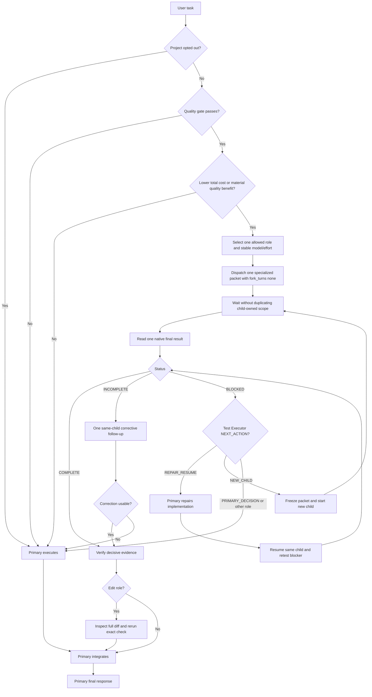

# Sol Advisor

Sol Advisor is a Codex plugin for quality-first, bounded functional-subagent
orchestration. Task accuracy and first-pass completion are hard gates. Among routes
that preserve them, Sol Advisor minimizes expected total workflow cost before reducing
context pollution or latency.

The primary session owns requirements, architecture, design-dependent or iterative
implementation, cross-module behavioral changes, final verification, integration, and
release decisions. Children handle only bounded investigation, identified-source
analysis, focused local production, repeated mechanical transformations, resumable
test-plan execution, independent verification, or evidence adjudication.

## Roles

| Native agent type | Allowed model / effort | Scenario | Responsibility |
|---|---|---|---|
| `sol_advisor_spark_worker` | Spark/low, medium, or high | compact, frozen local production goal | focused serial `PRODUCE` |
| `sol_advisor_investigator` | Luna/medium, high, xHigh, or Max | unknown-location search, relationship tracing, official research | read-only investigation |
| `sol_advisor_context_analyst` | Luna/medium or High; Terra/high, xHigh, or Max | identified long-source extraction or cross-module synthesis | read-only context analysis |
| `sol_advisor_mechanical_editor` | Luna/high, xHigh, or Max | large, fully determined repetitive edits | bounded serial edit |
| `sol_advisor_test_executor` | Luna/xHigh or Max | primary-authored ordered test plan | resumable test execution without fixes |
| `sol_advisor_local_code_verifier` | Luna/medium, high, xHigh, or Max; Sol/xHigh or Max | routine through high-risk implementation review | read-only verification |
| `sol_advisor_final_adjudicator` | Sol/xHigh or Max | genuine evidence conflict or critical decision | read-only adjudication |

Context Analyst and Local Code Verifier deliberately do not pin a base model in their
TOML profiles. The primary must pass both the selected model and effort at spawn.
Pinned roles, including Test Executor on Luna, receive only an effort override. Spark
effort is selected before spawn; there is no literal automatic effort value. This
follows the inheritance and override behavior documented in
[Codex subagents](https://learn.chatgpt.com/docs/agent-configuration/subagents).

Spark and GPT-5.6 are treated as separate quota pools. Spark is reserved for compact,
focused production that remains within its quality boundary; OpenAI describes it as a
separate, faster, less-capable model with its own usage limits in
[Codex speed](https://learn.chatgpt.com/docs/agent-configuration/speed).

## Quality and total-cost gates

Implicit route evaluation is globally allowed when the plugin is installed and
enabled. Delegation still requires all of the following:

- the current project has not opted out;
- one role owns a bounded question, focused local production goal, repeated exact
  transformation, or frozen ordered test plan;
- the selected model and effort are adequate for the risk;
- scope, completion, stopping, and verification criteria are explicit;
- first-pass accuracy and completion reliability are not expected to decline; and
- expected total workflow cost is lower, evidence isolation is likely to prevent a
  quality loss, or independent verification materially improves decision quality.

Total workflow cost includes primary work avoided and added, child model and tool work,
result intake, bounded verification, and likely correction or escalation. A cheaper
child model does not by itself establish a cheaper workflow.

Use zero children when the primary already has bounded evidence, direct tools are
sufficient, expected total cost is not lower and there is no material quality benefit,
dispatch would duplicate work, or implementation needs continuing design judgment.
After deciding to delegate, use one child by default.
Use at most two concurrent children, only for read-only work with mutually exclusive
decisions, source scopes, and failure classes.

Do not delegate implementation that requires architecture or design judgment,
cross-module behavior changes, public-interface or dependency changes, repeated
debugging, safety-critical implementation, or final integration. Spark and Mechanical
Editor write only after the primary freezes their respective production goal or
transformation, ownership, preservation rules, completion criteria, and mechanical
check.

## Optional context preflight

When an obvious, cheap, read-only prerequisite could invalidate heavy retrieval or
delegation, the primary may check it first. This is optional context hygiene, not a
fixed phase, delegation trigger, or required order. When practical, complete items from
a partial batch remain valid and only failed, missing, truncated, or invalidated items
are retried.

A large model context window is available capacity, not a target to fill. Sol Advisor
does not infer ChatGPT subscription credit multipliers from API pricing thresholds; it
uses observed Codex usage when available and otherwise compares relative route cost.

## Global default and project opt-out

Installing and enabling Sol Advisor makes its implicit-capable orchestration Skill
eligible in repositories, non-Git directories, empty folders, and from-scratch
workspaces. Eligibility permits automatic consideration but does not require a route
record or child. A workspace does not need a project `.agent` directory, authorization
file, or local `AGENTS.md`.

To disable implicit Sol Advisor delegation for one workspace, create a schema-v1
`.agent/authorizations.json` at its root. In a plain non-repository directory, the
current working directory is the workspace root:

```json
{
  "schemaVersion": 1,
  "authorizations": {
    "solAdvisor": {
      "implicitDelegation": false
    }
  }
}
```

An applicable `AGENTS.md` instruction can also explicitly disable Sol Advisor or all
delegation. Codex `agents.enabled = false` disables multi-agent tools independently.
Legacy `implicitDelegation: true` remains valid but is unnecessary; a missing file or
key leaves the global default enabled. An existing invalid or unreadable override
fails safe to primary-only execution until corrected.

An explicit current-task request to use Sol Advisor or `$orchestration` bypasses a
project opt-out. An explicit current-task instruction not to delegate always wins.

Sol Advisor never writes user- or project-level `AGENTS.md` files or `.agent` context,
authorization, plan, and handoff files. For durable project initialization and policy
management, use Codex Project Context: it owns those project surfaces and emits a
minimal integration section that Sol Advisor only reads. The two plugins remain
independently usable.

## Native orchestration flow



Every child activation returns one ordinary final response and ends immediately. It
does not send progress, status, or results through parent-interaction messaging or
remain active. A blocked Test Executor may be reactivated after the primary repairs
the implementation only when `NEXT_ACTION: REPAIR_RESUME`; it never waits during that
repair. The primary reads each final once and uses detailed child history only to
diagnose a concrete unusable-final or lifecycle failure.

## Stable configuration and prompt caching

At spawn the primary commits to:

`role + mode + model + effort + prompt version + tool/config prefix`

Model and effort do not change during that child. One corrective follow-up reuses the
same child and configuration. If stronger capability is required, the current child
ends as `INCOMPLETE` or `BLOCKED`; the primary takes over or creates one new stronger
child and accepts a new cold start.

Test Executor adds a separate repair-resume follow-up. The same native child may be
reactivated repeatedly only after `NEXT_ACTION: REPAIR_RESUME` and for the same
`PLAN_ID`, model, effort, and material scope. Each resume receives the repair evidence,
invalidated prerequisites, and prior resume point, then retests the blocker before
continuing. `NEW_CHILD` starts a new frozen packet; `PRIMARY_DECISION` returns control
to the primary. A new full run or material plan or scope change requires a new child.

Stable instructions and tool definitions precede variable task data. This avoids
configuration-driven cache misses but does not guarantee a hit; actual caching still
depends on an exact eligible prefix. See
[OpenAI Prompt Caching](https://developers.openai.com/api/docs/guides/prompt-caching).

## Specialized result contracts

All roles use `STATUS: COMPLETE | INCOMPLETE | BLOCKED`, but no universal paragraph
layout is required. Each role returns only its required fields and nonempty optional
fields:

- Investigator: `ANSWER`, `EVIDENCE`; optional `FINDINGS`, `UNKNOWNS`.
- Context Analyst: `SYNTHESIS`, `SOURCE_LOCATORS`; optional `CONSTRAINTS`, `CONFLICTS`,
  `UNCERTAINTY`.
- Mechanical Editor: `CHANGED_FILES`, `CHECK`; optional `RESULT`, `DEVIATIONS`.
- Test Executor: `PLAN_RESULT`, `EVIDENCE`, `COVERAGE`, `TARGET_STATE`; when blocked,
  `NEXT_ACTION`, `BLOCKER`; only for `REPAIR_RESUME`, `RESUME_POINT`,
  `REMAINING_TESTS`; optional `FINDINGS`, `OUTPUT_ARTIFACTS`.
- Local Code Verifier: `VERDICT`, `EVIDENCE`, `COVERAGE`; optional `FINDINGS`,
  `TEST_GAPS`.
- Final Adjudicator: `VERDICT`, `DECISIVE_EVIDENCE`, `REJECTED_ASSUMPTIONS`,
  `REQUIRED_ACTION`.
- Spark `PRODUCE`: `CHANGED_FILES`, `CHECK`; optional `DEVIATIONS`, `UNVERIFIED`.

The common lifecycle and role index are in
`plugins/sol-advisor/skills/orchestration/references/role-contracts.md`. Detailed
dispatch fields, stopping rules, and soft output budgets are split under
`references/roles/`; only the selected role file is loaded.

Only one corrective follow-up is allowed. It identifies one exact omission, missing
evidence, and correct prior work to preserve. Formatting alone never triggers a retry.
Test Executor repair-resume turns are a role-scoped exception and do not consume that
corrective follow-up.

## Native lifecycle and static validation boundary

Normal orchestration creates no dispatch plan, run directory, `state.json`, pending
record, response token, result path, or result sidecar. No Python script accepts,
rejects, or retries a child's natural-language final. Codex native child status and the
ordinary final response are the runtime lifecycle source of truth.

Development-time Python remains allowed for deterministic TOML, JSON, routing, prompt,
installer, and fixture checks. Those checks never participate in child dispatch or
result intake.

## Capability inheritance

Every child follows the `AGENTS.md` files applicable to its working directory and the
parent task's active instructions, sandbox, permissions, and project rules. Agent TOML
files omit MCP, Skill, web, shell-environment, and sandbox overrides, so the runtime
provides inherited capabilities.

Role responsibility constrains behavior rather than tools. Investigator, Context
Analyst, Local Code Verifier, and Final Adjudicator remain read-only. Test Executor
keeps source and configuration read-only, writes evidence only to its declared output,
and performs only plan-authorized target-state changes. Mechanical Editor and Spark
`PRODUCE` may modify only their assigned files.

The plugin continues to bundle optional Context7, Exa, and MarkItDown MCP companions.
It does not require a particular index or deny other inherited capabilities.

## Route boundaries

- Available MCP, index, or exact reads in the primary session handle bounded symbol,
  relationship, configuration, and log lookup; Spark does not scout.
- Spark `PRODUCE`: one frozen local production goal with compact named inputs,
  explicitly owned files, mechanical acceptance, and no architecture, public-API,
  dependency, security, authentication, concurrency, state, migration, cross-module,
  search, or continuing-debugging requirement.
- Investigator: unknown evidence locations or current official-source reconciliation.
- Context Analyst: already identified long sources; Luna/High for extraction,
  Terra/xHigh or Max for synthesis.
- Mechanical Editor: one fully determined transformation repeated across known
  locations; not one focused local behavior-production goal.
- Test Executor: one primary-authored ordered plan with stable test IDs, dependencies,
  pass/fail criteria, authorized side effects, evidence output, and stop conditions;
  findings are recorded but implementation is never repaired.
- Local Code Verifier: one implementation or verification claim attacked from one
  failure class; it never owns a whole ordered plan or its repair-resume state. Use
  Luna for routine through difficult bounded review and Sol only for high-risk or
  irreversible verification.
- Final Adjudicator: genuine evidence conflict or critical decision only.

Investigator and Context Analyst are alternative discovery lanes. Spark `PRODUCE` and
Mechanical Editor are mutually exclusive by work type and never share the same batch.
Test Executor and Local Code Verifier are mutually exclusive for one assignment.
Children do not communicate directly; the primary reviews and transfers dependent
results. An edit does not automatically trigger a verifier, and Final Adjudicator is
not a routine closing step.

## Installation

Install from the standalone marketplace:

```sh
codex plugin marketplace add shjqwert/sol-advisor-auto --ref main
codex plugin add sol-advisor@sol-advisor
```

Plugin installation does not write user- or project-owned instructions or custom-agent
files. Install the seven native templates separately:

```sh
plugin_dir="$(codex plugin list --json | jq -r '.installed[] | select(.pluginId == "sol-advisor@sol-advisor") | .source.path')"
test -d "$plugin_dir"
sh "$plugin_dir/scripts/install-agents.sh"
sh "$plugin_dir/scripts/install-agents.sh" --check
```

For an existing exact recognized Sol Advisor installation, use the managed upgrade:

```sh
sh "$plugin_dir/scripts/install-agents.sh" --upgrade-managed
sh "$plugin_dir/scripts/install-agents.sh" --check
```

Managed upgrade recognizes only exact shipped template hashes, including the managed
0.7 set and the changed 0.9.4 Spark and Mechanical Editor templates. It stages all
seven files and rolls back the batch on failure. Any user-modified or unknown file
aborts before mutation. Normal installation still refuses every differing file.

Windows PowerShell example:

```powershell
$pluginDir = (codex plugin list --json | ConvertFrom-Json).installed |
  Where-Object pluginId -eq 'sol-advisor@sol-advisor' |
  Select-Object -ExpandProperty source |
  Select-Object -ExpandProperty path
$pluginDirWsl = wsl wslpath -a -u ($pluginDir -replace '\\','/')
$agentDirWsl = wsl wslpath -a -u (("$env:USERPROFILE\.codex\agents") -replace '\\','/')
wsl sh "$pluginDirWsl/scripts/install-agents.sh" --target-dir $agentDirWsl --upgrade-managed
wsl sh "$pluginDirWsl/scripts/install-agents.sh" --target-dir $agentDirWsl --check
```

Start a new Codex task after installation so native roles and the bundled Skill are
rediscovered. If a new task still advertises an older cache path, reload Codex Desktop
before creating another task.

## Optional diagnostics

These development diagnostics do not gate normal dispatch:

```sh
sh "$plugin_dir/scripts/validate-agent-route.sh" \
  sol_advisor_context_analyst openai gpt-5.6-luna high

sh "$plugin_dir/scripts/inspect-agent-runtime.sh" \
  <native-subagent-thread-id>
```

The route script checks a documented role/model/effort combination. The runtime
inspector emits only allowlisted routing fields and rejects a thread whose model or
effort changes between turns.

## Local development

Install a checkout as a local marketplace:

```sh
cd /absolute/path/to/sol-advisor
codex plugin marketplace add /absolute/path/to/sol-advisor
codex plugin add sol-advisor@sol-advisor
```

Run no-cost checks:

```sh
sh plugins/sol-advisor/scripts/verify.sh
git diff --check
```

The verifier checks the seven role configurations, specialized prompts, documented and
rejected routes, exact managed upgrades and rollback, runtime configuration stability,
global-default and workspace-opt-out policy, the no-`AGENTS.md`-writer boundary,
native lifecycle, static Python checks, and retired sidecar absence. It invokes no
model or paid API.

Actual native-agent smoke tests can consume model quota and require separate user
authorization.

## License

MIT
