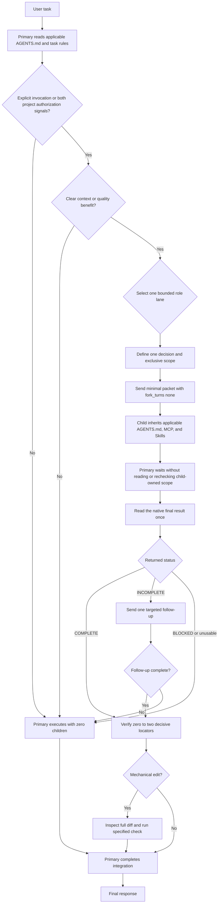

# Sol Advisor

Sol Advisor is a Codex plugin for automatic, bounded functional-subagent orchestration.
The primary session owns requirements, architecture, complex implementation, final
verification, and integration. Children handle only bounded investigation, context
analysis, deterministic edits, independent verification, or evidence adjudication.

## Roles

| Native agent type | Model / effort | Scenario | Responsibility |
|---|---|---|---|
| `sol_advisor_investigator` | Luna/xHigh or Max | repository search, precision lookup, external research | read-only bounded investigation |
| `sol_advisor_context_analyst` | Terra/High, xHigh, or Max | long documents, broad context, cross-module constraints | read-only context analysis |
| `sol_advisor_mechanical_editor` | Luna/xHigh or Max | fully determined repetitive or bulk edits | bounded serial edits |
| `sol_advisor_local_code_verifier` | Luna/Max | implementation, boundary, and test-gap review | read-only local verification |
| `sol_advisor_final_adjudicator` | Sol/Medium, xHigh, or Max | genuine evidence conflict or critical decision | read-only adjudication |

Complex implementation remains in the primary session. Role selection defines what a
child is responsible for; it does not reduce the child's inherited capabilities.

## Project authorization

Implicit child dispatch is fail-closed. It requires both an exact schema-v1
`.agent/authorizations.json` value of
`authorizations.solAdvisor.implicitDelegation: true` and the matching
`## Subagent Orchestration` instruction in the applicable project-context managed
section of `AGENTS.md`. Missing, invalid, false, or one-sided signals keep execution in
the primary session.

An explicit user invocation of Sol Advisor or its orchestration Skill bypasses this
project gate for that task. An explicit instruction not to delegate always wins. The
`codex-project-context` plugin can add or remove both project signals through its
authorization command; authorization remains absent by default.

## Native orchestration flow



Sol Advisor uses Codex native child status and results directly. A normal dispatch does
not create a plan file, run directory, state file, pending record, response token,
machine sidecar, visible-result copy, or runtime-result copy. No Python script validates
the dispatch plan or child-result format.

Each child returns its result once as the ordinary final response and ends its turn.
It does not send progress or results through parent-interaction messaging and remain
active after the useful result is available.

The primary follows `DECIDE -> DISPATCH -> WAIT -> INTAKE -> VERIFY -> ACT`. During
`WAIT`, it does not search, read, test, or analyze the child-owned question or source
scope and does not inspect interim output. It reads the native final once after
completion; detailed child history is diagnostic-only for an unusable final or a
concrete lifecycle failure.

## Capability inheritance

Every child follows the `AGENTS.md` files applicable to its working directory and the
parent task's active system, developer, sandbox, permission, and project rules.
Custom-agent files omit MCP, Skill, web-search, shell-environment, and sandbox
overrides, so the runtime can provide the same parent capabilities.

Sol Advisor defines no MCP or Skill allowlist or denylist. A role may use any inherited
capability relevant to its bounded task. Behavioral responsibility still applies:
investigators, analysts, verifiers, and adjudicators remain read-only; the mechanical
editor may change only its assigned files.

The plugin bundles three useful MCP companions without making them mandatory routes:

- Context7 for version-aware library and API documentation;
- Exa for current web search and clean page retrieval;
- MarkItDown for local document conversion.

Inherited CodeGraph, Serena, document Skills, browser, web, or other MCP capabilities
remain available when the parent runtime exposes them.

## Result handling and fallback

Every child final reports `STATUS: COMPLETE | INCOMPLETE | BLOCKED`, `RETURN_MODE`,
task understanding, answer or verdict, decision-changing findings, evidence, coverage,
uncertainty, and required action. Return modes use soft budgets: COMPACT is normally
600-1200 characters, STANDARD 1200-3000, and EXTENDED starts with a compact decision
summary followed by all findings required for completeness. Completeness overrides
length; raw logs, large code excerpts, tool narration, and repetition are omitted.

The primary classifies that final once:

- `COMPLETE` and usable: integrate it and verify zero to two decisive locators without
  recreating the investigation;
- `INCOMPLETE` and correctable: send one precise follow-up to the same native child;
- `BLOCKED` or unusable: stop delegation and execute the work in the primary session,
  or report a genuine blocker.

Only one corrective follow-up is allowed for a child. It should identify the exact
misunderstanding or missing evidence and preserve correct prior work. If that follow-up
still fails, the primary takes over immediately. There is no retry state file and no
format-driven retry loop.

## Delegation bounds

- Use the zero-child fast path when scope, requirements, context, and verification are
  already bounded and no material uncertainty remains.
- Route unknown-location cross-module call paths and current official-source
  reconciliation to Investigator.
- Route identified long sources, logs, or constraint-heavy cross-module material to
  Context Analyst; Investigator and Context Analyst remain alternative discovery lanes.
- Route an exact deterministic transformation to Mechanical Editor only when file
  ownership, preservation rules, and a mechanical check are fixed and it covers at
  least four files, or at least twenty same-type edit points across two or more files.
- Route an explicitly requested independent boundary-condition or test-gap attack, or
  material safety, authorization, concurrency, state, data, migration, or public-API
  risk left after implementation, to Local Code Verifier.
- Use one child by default.
- Use at most two concurrent children, only for read-only work with mutually exclusive
  decisions, source scopes, and failure classes.
- Investigator and Context Analyst are alternative discovery lanes; never call both
  for the same question.
- Mechanical Editor does not automatically trigger Local Code Verifier. Add verification
  only when substantive uncertainty remains after primary diff inspection and tests.
- Final Adjudicator is not a routine closing step; reserve it for a genuine unresolved
  evidence conflict or critical-risk decision.
- Keep shared files, dependency chains, mechanical edits, follow-ups, and adjudication
  serial.
- Children cannot spawn descendants.
- Keep questions narrow. Primary-context isolation and task accuracy are the acceptance
  goals; total tokens, latency, and effective model cost are secondary diagnostics.

Low-risk work needs no automatic child review. Material uncertainty can use one
Luna/Max local verifier. Critical risk can add an independent Terra/Max cross-module
analysis. Sol adjudication is reserved for a genuine unresolved evidence conflict or
critical decision.

## Search policy

The orchestration Skill selects from inherited capabilities by intent:

- symbols and references: Serena, then CodeGraph, then exact text search;
- call paths, impact, and architecture: CodeGraph, then Serena, then exact text search;
- configuration and logs: exact text search and targeted reads;
- library/API documentation: Context7, then official documentation;
- current web facts: built-in web, then Exa;
- local PDF/Office documents: MarkItDown, then inherited document/PDF Skills.

When broad local search needs an index and metadata writes are authorized, the primary
may run:

```sh
sh "$plugin_dir/scripts/run-python.sh" \
  "$plugin_dir/scripts/prepare-repo-search.py" /exact/workspace/root \
  --indexing create-if-missing --apply
```

The preflight never stages generated metadata and falls back to exact text search when
CodeGraph or Serena is unavailable.

## Installation

Install from the standalone marketplace:

```sh
codex plugin marketplace add shjqwert/sol-advisor-auto --ref main
codex plugin add sol-advisor@sol-advisor
```

Plugin installation does not write user-owned custom-agent files. Install the five
native role templates separately:

```sh
plugin_dir="$(codex plugin list --json | jq -r '.installed[] | select(.pluginId == "sol-advisor@sol-advisor") | .source.path')"
test -d "$plugin_dir"
sh "$plugin_dir/scripts/install-agents.sh"
sh "$plugin_dir/scripts/install-agents.sh" --check
```

Windows PowerShell example:

```powershell
$pluginDir = (codex plugin list --json | ConvertFrom-Json).installed |
  Where-Object pluginId -eq 'sol-advisor@sol-advisor' |
  Select-Object -ExpandProperty source |
  Select-Object -ExpandProperty path
$pluginDirWsl = wsl wslpath -a -u ($pluginDir -replace '\\','/')
$agentDirWsl = wsl wslpath -a -u (("$env:USERPROFILE\.codex\agents") -replace '\\','/')
wsl sh "$pluginDirWsl/scripts/install-agents.sh" --target-dir $agentDirWsl
wsl sh "$pluginDirWsl/scripts/install-agents.sh" --target-dir $agentDirWsl --check
```

The installer adds only missing templates, never edits `config.toml`, and refuses to
overwrite a differing file. Start a new Codex task after installation so the native
roles and bundled Skill are rediscovered. If `codex plugin list --json` shows the new
version but a new Desktop task still advertises an older cache path, reload Codex
Desktop before creating the task; task/plugin catalogs are runtime snapshots. Do not
copy a new version into a stale versioned cache directory.

## Optional diagnostics

Normal orchestration does not require route or rollout validation. For plugin
development only, these read-only diagnostics remain available:

```sh
sh "$plugin_dir/scripts/validate-agent-route.sh" \
  sol_advisor_context_analyst openai gpt-5.6-terra high

sh "$plugin_dir/scripts/inspect-agent-runtime.sh" \
  <native-subagent-thread-id>
```

The route script checks a documented role/model/effort combination. The runtime
inspector emits only allowlisted routing fields from one exact native child rollout.
Neither script gates normal child dispatch or records normal child results.

## Local development

Install a checkout as a local marketplace:

```sh
cd /absolute/path/to/sol-advisor
codex plugin marketplace add /absolute/path/to/sol-advisor
codex plugin add sol-advisor@sol-advisor
```

Run no-cost checks:

```sh
sh plugins/sol-advisor/scripts/verify.sh
git diff --check
```

The verifier checks manifests, role inheritance, documented routes, native fallback
rules, installer safety, search-index preflight, optional diagnostics, shell syntax,
and the absence of the retired state and result protocol. It does not invoke a model
or API.

Actual native-agent smoke tests can incur model/API cost and require separate user
authorization.

## License

MIT
