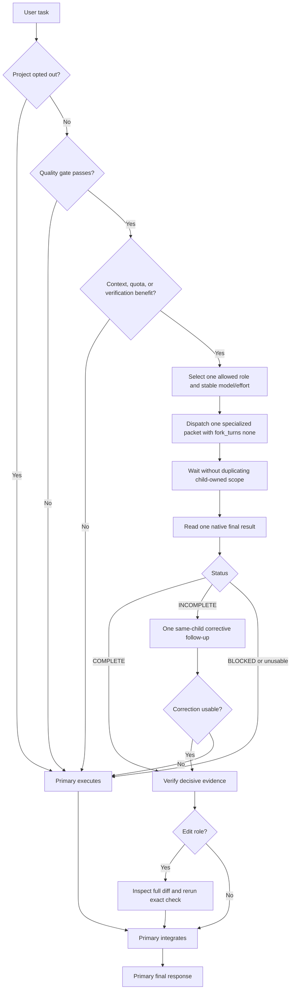

# Sol Advisor

Sol Advisor is a Codex plugin for quality-first, bounded functional-subagent
orchestration. It delegates only when task accuracy and completion are protected and a
child provides material primary-context, weighted quota, or independent-verification
benefit. Latency is a lower priority.

The primary session owns requirements, architecture, design-dependent or iterative
implementation, cross-module behavioral changes, final verification, integration, and
release decisions. Children handle only bounded investigation, identified-source
analysis, deterministic edits, independent verification, or evidence adjudication.

## Roles

| Native agent type | Allowed model / effort | Scenario | Responsibility |
|---|---|---|---|
| `sol_advisor_spark_worker` | Spark/low, medium, or high | exact scouting or a small low-risk deterministic edit | read-only `SCOUT` or bounded serial `EDIT` |
| `sol_advisor_investigator` | Luna/high, xHigh, or Max | unknown-location search, relationship tracing, official research | read-only investigation |
| `sol_advisor_context_analyst` | Luna/High; Terra/xHigh or Max | identified long-source extraction or cross-module synthesis | read-only context analysis |
| `sol_advisor_mechanical_editor` | Luna/xHigh or Max | large, fully determined repetitive edits | bounded serial edit |
| `sol_advisor_local_code_verifier` | Luna/high, xHigh, or Max; Sol/xHigh or Max | routine through high-risk implementation review | read-only verification |
| `sol_advisor_final_adjudicator` | Sol/xHigh or Max | genuine evidence conflict or critical decision | read-only adjudication |

Context Analyst and Local Code Verifier deliberately do not pin a base model in their
TOML profiles. The primary must pass both the selected model and effort at spawn.
Pinned roles receive only an effort override. Spark effort is selected before spawn;
there is no literal automatic effort value. This follows the inheritance and override
behavior documented in [Codex subagents](https://learn.chatgpt.com/docs/agent-configuration/subagents).

Spark and GPT-5.6 are treated as separate quota pools. Spark is reserved for light work
that remains within its quality boundary; OpenAI describes it as a separate, faster,
less-capable model with its own usage limits in
[Codex speed](https://learn.chatgpt.com/docs/agent-configuration/speed).

## Quality and delegation gates

Implicit route evaluation is globally allowed when the plugin is installed and
enabled. Delegation still requires all of the following:

- the current project has not opted out;
- one role owns a bounded question or deterministic edit;
- the selected model and effort are adequate for the risk;
- scope, completion, stopping, and verification criteria are explicit;
- first-pass accuracy and completion reliability are not expected to decline; and
- delegation materially improves primary-context isolation, weighted quota cost, or
  independent verification.

Use zero children when the primary already has bounded evidence, when dispatch would
duplicate work, or when implementation needs continuing design judgment. Use one child
by default. Use at most two concurrent children, only for read-only work with mutually
exclusive decisions, source scopes, and failure classes.

Do not delegate implementation that requires architecture or design judgment,
cross-module behavior changes, public-interface or dependency changes, repeated
debugging, safety-critical implementation, or final integration. Spark and Mechanical
Editor write only after the primary fixes the transformation, ownership, preservation
rules, edit count, and mechanical check.

## Global default and project opt-out

Installing and enabling Sol Advisor globally allows automatic route evaluation in
every project. A project does not need an `.agent` directory, an authorization file,
or a managed `AGENTS.md` section. The quality and benefit gates still decide whether
zero or one child is appropriate.

To disable implicit Sol Advisor delegation for one project, create a schema-v1
`.agent/authorizations.json` at that project root:

```json
{
  "schemaVersion": 1,
  "authorizations": {
    "solAdvisor": {
      "implicitDelegation": false
    }
  }
}
```

An applicable `AGENTS.md` instruction can also explicitly disable Sol Advisor or all
delegation. Codex `agents.enabled = false` disables multi-agent tools independently.
Legacy `implicitDelegation: true` remains valid but is unnecessary; a missing file or
key leaves the global default enabled. An existing invalid or unreadable override
fails safe to primary-only execution until corrected.

An explicit current-task request to use Sol Advisor or `$orchestration` bypasses a
project opt-out. An explicit current-task instruction not to delegate always wins.

## Native orchestration flow



Every child returns one ordinary final response and ends immediately. It does not send
progress, status, or results through parent-interaction messaging and remain active.
The primary reads the final once and uses detailed child history only to diagnose a
concrete unusable-final or lifecycle failure.

## Stable configuration and prompt caching

At spawn the primary commits to:

`role + mode + model + effort + prompt version + tool/config prefix`

Model and effort do not change during that child. One corrective follow-up reuses the
same child and configuration. If stronger capability is required, the current child
ends as `INCOMPLETE` or `BLOCKED`; the primary takes over or creates one new stronger
child and accepts a new cold start.

Stable instructions and tool definitions precede variable task data. This avoids
configuration-driven cache misses but does not guarantee a hit; actual caching still
depends on an exact eligible prefix. See
[OpenAI Prompt Caching](https://developers.openai.com/api/docs/guides/prompt-caching).

## Specialized result contracts

All roles use `STATUS: COMPLETE | INCOMPLETE | BLOCKED`, but no universal paragraph
layout is required. Each role returns only its required fields and nonempty optional
fields:

- Investigator: `ANSWER`, `EVIDENCE`; optional `FINDINGS`, `UNKNOWNS`.
- Context Analyst: `SYNTHESIS`, `SOURCE_LOCATORS`; optional `CONSTRAINTS`, `CONFLICTS`,
  `UNCERTAINTY`.
- Mechanical Editor: `CHANGED_FILES`, `CHECK`; optional `RESULT`, `DEVIATIONS`.
- Local Code Verifier: `VERDICT`, `EVIDENCE`, `COVERAGE`; optional `FINDINGS`,
  `TEST_GAPS`.
- Final Adjudicator: `VERDICT`, `DECISIVE_EVIDENCE`, `REJECTED_ASSUMPTIONS`,
  `REQUIRED_ACTION`.
- Spark `SCOUT`: `ANSWER`, `LOCATORS`; optional `COVERAGE`.
- Spark `EDIT`: `CHANGED_FILES`, `CHECK`; optional `DEVIATIONS`.

Detailed dispatch fields, stopping rules, and soft output budgets are in
`plugins/sol-advisor/skills/orchestration/references/role-contracts.md` and are loaded
only for the selected role.

Only one corrective follow-up is allowed. It identifies one exact omission, missing
evidence, and correct prior work to preserve. Formatting alone never triggers a retry.

## Native lifecycle and static validation boundary

Normal orchestration creates no dispatch plan, run directory, `state.json`, pending
record, response token, result path, or result sidecar. No Python script accepts,
rejects, or retries a child's natural-language final. Codex native child status and the
ordinary final response are the runtime lifecycle source of truth.

Development-time Python remains allowed for deterministic TOML, JSON, routing, prompt,
installer, and fixture checks. Those checks never participate in child dispatch or
result intake.

## Capability inheritance

Every child follows the `AGENTS.md` files applicable to its working directory and the
parent task's active instructions, sandbox, permissions, and project rules. Agent TOML
files omit MCP, Skill, web, shell-environment, and sandbox overrides, so the runtime
provides inherited capabilities.

Role responsibility constrains behavior rather than tools. Investigator, Context
Analyst, Local Code Verifier, Final Adjudicator, and Spark `SCOUT` remain read-only.
Mechanical Editor and Spark `EDIT` may modify only their assigned files.

The plugin continues to bundle optional Context7, Exa, and MarkItDown MCP companions.
It does not require a particular index or deny other inherited capabilities.

## Route boundaries

- Spark `SCOUT`: exact lookup, inventory, or narrow path mapping; no external research
  or design judgment.
- Spark `EDIT`: at most 3 files and 19 same-type points; no architecture, dependency,
  security, authorization, concurrency, state, data, migration, or public-API work.
- Investigator: unknown evidence locations or current official-source reconciliation.
- Context Analyst: already identified long sources; Luna/High for extraction,
  Terra/xHigh or Max for synthesis.
- Mechanical Editor: at least 4 files, or at least 20 same-type points across at least
  2 files.
- Local Code Verifier: Luna for routine through difficult bounded review; Sol only for
  high-risk or irreversible verification.
- Final Adjudicator: genuine evidence conflict or critical decision only.

Investigator and Context Analyst are alternative discovery lanes. Spark `EDIT` and
Mechanical Editor never share the same batch. An edit does not automatically trigger a
verifier, and Final Adjudicator is not a routine closing step.

## Installation

Install from the standalone marketplace:

```sh
codex plugin marketplace add shjqwert/sol-advisor-auto --ref main
codex plugin add sol-advisor@sol-advisor
```

Plugin installation does not write user-owned custom-agent files. Install the six
native templates separately:

```sh
plugin_dir="$(codex plugin list --json | jq -r '.installed[] | select(.pluginId == "sol-advisor@sol-advisor") | .source.path')"
test -d "$plugin_dir"
sh "$plugin_dir/scripts/install-agents.sh"
sh "$plugin_dir/scripts/install-agents.sh" --check
```

For an existing exact Sol Advisor 0.7 installation, use the managed upgrade:

```sh
sh "$plugin_dir/scripts/install-agents.sh" --upgrade-managed
sh "$plugin_dir/scripts/install-agents.sh" --check
```

Managed upgrade recognizes only exact shipped 0.7 template hashes, stages all six new
files, adds Spark, and rolls back the batch on failure. Any user-modified or unknown
file aborts before mutation. Normal installation still refuses every differing file.

Windows PowerShell example:

```powershell
$pluginDir = (codex plugin list --json | ConvertFrom-Json).installed |
  Where-Object pluginId -eq 'sol-advisor@sol-advisor' |
  Select-Object -ExpandProperty source |
  Select-Object -ExpandProperty path
$pluginDirWsl = wsl wslpath -a -u ($pluginDir -replace '\\','/')
$agentDirWsl = wsl wslpath -a -u (("$env:USERPROFILE\.codex\agents") -replace '\\','/')
wsl sh "$pluginDirWsl/scripts/install-agents.sh" --target-dir $agentDirWsl --upgrade-managed
wsl sh "$pluginDirWsl/scripts/install-agents.sh" --target-dir $agentDirWsl --check
```

Start a new Codex task after installation so native roles and the bundled Skill are
rediscovered. If a new task still advertises an older cache path, reload Codex Desktop
before creating another task.

## Optional diagnostics

These development diagnostics do not gate normal dispatch:

```sh
sh "$plugin_dir/scripts/validate-agent-route.sh" \
  sol_advisor_context_analyst openai gpt-5.6-luna high

sh "$plugin_dir/scripts/inspect-agent-runtime.sh" \
  <native-subagent-thread-id>
```

The route script checks a documented role/model/effort combination. The runtime
inspector emits only allowlisted routing fields and rejects a thread whose model or
effort changes between turns.

## Local development

Install a checkout as a local marketplace:

```sh
cd /absolute/path/to/sol-advisor
codex plugin marketplace add /absolute/path/to/sol-advisor
codex plugin add sol-advisor@sol-advisor
```

Run no-cost checks:

```sh
sh plugins/sol-advisor/scripts/verify.sh
git diff --check
```

The verifier checks the six role configurations, specialized prompts, documented and
rejected routes, exact managed upgrades, rollback, runtime configuration stability,
global-default and project-opt-out policy, native lifecycle, static Python checks, and
retired sidecar absence. It invokes no model or paid API.

Actual native-agent smoke tests can consume model quota and require separate user
authorization.

## License

MIT
