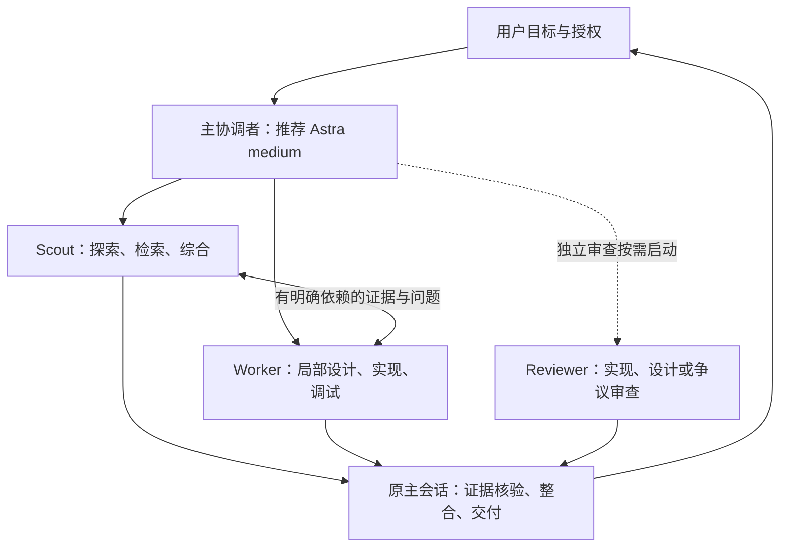

# Sol Advisor 2.0 架构设计

日期：2026-09-10。状态：用户已确认执行；2.0.0 源码重构已落地，原生角色加载与协作实测待完成。

本轮修订以 Eric Provencher 的《Practical multi-agent orchestration in Codex》为主要参考：使用原生协作能力，保留简短调度原则和明确分工，按任务调整推理强度与上下文。用户已确定 Scout 默认 Luna high，角色名字带实际模型后缀。此前图片和旧仓库只提供有用补充，不再决定整套执行流程。

用户已同意重新设计子代理并确认开始执行，仓库已替换旧运行模板与契约；旧模板原样保留为迁移夹具。当前仓库版本为 2.0.0，已安装插件未在本次更新。编译、全局安装、发布和高成本实验继续遵守对应授权。本文是设计与实施依据，不覆盖系统、应用或项目授权。

## 1. 目标与完成条件

将插件重构为轻量编排策略：主协调者负责任务分解与整合，Scout 负责有界取证，Worker 负责有界实现，Reviewer 负责独立审查。任务准确性、证据完整性和授权边界是硬门槛；通过后比较一次完成率、全流程耗时和可获得的真实用量。

新版本完成条件：三种职责及模型配置一致；有代表性的真实协作覆盖探索、实现、消息和失败接管；受管迁移保护用户修改并能处理安装失败。成本优化另用受控评估支持，不把全面 A/B 实验变成每次功能交付的前置条件。文档完成不等于新版本完成。

首版不引入递归委派、运行期调度程序、消息总线、数据库、结果 sidecar 或跨任务记忆库。现有 P002 证据持久化方向继续单独管理，不绑定到本次升级。保留 Git、SVN、普通目录和无索引环境的适用性。

### 运行期 Skill 的核心规则

1. 只拆有实质收益的工作；小任务直接完成。
2. 为代理说明任务、负责范围、完成条件和关键限制。
3. Scout 用 Luna high 做有界只读调查；Worker 用 Sol medium，困难实现用 high；Reviewer 按需启动。
4. Scout 默认 fresh context；其他代理按需要选择上下文，不复制无关历史。
5. 明确叶子代理直接完成任务，不继续委派。
6. 发现队友需要的信息就直接发消息；分工和范围变化交主协调者。
7. 避免重复调查、重叠写入和独占资源冲突，保留用户修改。
8. 主协调者保持与用户沟通，继续独立工作；缺信息或无进展时调整安排。
9. 返回普通结果、必要证据和未完成项；主协调者检查实际改动，复用有效验证并整合交付。
10. 项目规则和已有授权始终有效；审查与发布按任务需要，不自动增加阶段。

后文是开发设计、取舍依据和安装验收说明，不应整体转写进 Skill、角色提示词或每次派发消息。

## 2. 架构与责任层



图中每个节点表示职责，实际可以是零个、一个或多个实例。主协调者就是当前主会话，不再创建额外的 Coordinator 子代理。设计审查可发生在实现前，实现审查可发生在实现后，不形成固定流水线。

| 层 | 保存什么 | 不负责什么 |
|---|---|---|
| 系统、应用、用户与项目规则 | 授权、工具限制、编码规范、硬件约束 | 不由插件改写 |
| orchestration Skill | 何时直接执行、何时分工、如何整合 | 不罗列全部角色细节 |
| Agent TOML | 简短角色职责、名字对应的模型、叶子边界 | 不固化具体项目和任务 |
| 派发消息 | 当前任务、负责范围、必要上下文、完成条件和关键限制 | 不要求固定表单，不创建新的授权 |
| Codex 原生能力 | 创建、消息、等待、打断、继续、完成状态 | 插件不重新实现运行时 |
| 开发期脚本 | 配置一致性、迁移检查、测试与诊断 | 不裁决自然语言 final |

Skill 直接包含简短默认路由表，TOML 保存角色边界；首版不再拆分路由、协作、公共契约和三个角色参考文件。只有实际出现需要按需加载的大段专业知识时才增加参考文件。

## 3. 角色设计

采用 Scout、Worker、Reviewer 三种职责，并在原生角色名后追加实际模型标识；将模型名中的点和连字符规范为下划线。

| 原生角色名 | 模型 | 默认 effort |
|---|---|---|
| `sol_advisor_scout__gpt_5_6_luna` | `gpt-5.6-luna` | high |
| `sol_advisor_worker__gpt_5_6_sol` | `gpt-5.6-sol` | medium |
| `sol_advisor_reviewer__gpt_5_6_sol` | `gpt-5.6-sol` | high |
| `sol_advisor_reviewer__gpt_6_astra` | `gpt-6-astra` | xhigh |

这是三种职责、四个模型配置，不增加第四种职责。模型固定在对应 TOML，effort 由派发选择。运行实例用 `任务摘要__模型标识` 命名，如 `trace_boot__gpt_5_6_luna`；不把 effort 或状态再编码进名字。只有需要其他实际模型配置时才增加对应名字，不预建所有组合。

### 主协调者

- 明确用户目标与完成条件，消除影响范围、接口或授权的关键歧义。
- 决定是否委派，建立独占范围与依赖关系，分配模型和停止条件。
- 保持与用户沟通，持续处理独立工作；不重复代理正在负责的调查或修改。
- 处理跨任务设计、公共接口、分工变更、证据冲突及用户决策。
- 核对实际 diff 和关键证据，复用有效检查，完成整合与最终交付。
- 可以自行实现，尤其适合小任务、紧耦合修改、没有合适子代理或分工收益不足的情形。

### Scout：有界取证

- 定位文件、追踪调用或数据路径、查找相关测试与边界。
- 定向查找资料，核对版本、整理结论；不要求 CODE/RESEARCH/SYNTHESIS 模式字段。
- 可以从未知文件位置出发，但必须有明确问题、允许搜索的仓库/目录/资料范围，以及完成和停止条件。
- 返回每个子问题的答案、证据定位、适用范围与未知项；不得只交一段流畅摘要。
- 不修改工程文件、不安装或重建索引、不执行有侧作用的测试，不操作硬件。确需设备数据时由主协调者安排唯一操作者提供。
- 精确一次查询仍由主会话直接完成；检索到资料不自动触发第二个综合代理。

找不到时说明查过哪里、还缺什么；不能把搜索结束写成事实已确认。

### Worker：有界工程实现

主协调者说明任务、负责范围和完成条件，Worker 决定范围内的实现步骤。只补充真正影响工作的外部约束，不要求先冻结正式计划或填写派发表单。

| Worker 可自行决定 | 必须交回主协调者 |
|---|---|
| 自有模块内部算法、私有函数与局部结构 | 新公共接口或改变对外行为约定 |
| 范围内命名、实现顺序、相关测试用例 | 新依赖、跨模块架构或数据协议变化 |
| 根据实际失败证据做局部调试 | 修改他人所有的文件或共享配置 |
| 修复符合既定验收的局部缺陷 | 变更需求、验收、已接受风险或副作用 |
| 范围内的小型替代实现 | 超出原授权的构建、硬件、发布或破坏性操作 |

Worker 可以探索自己负责的模块，不需要每次阅读都再找 Scout。只有独立调查能减少等待或主任务需要专项证据时才让 Scout 配合。

局部调试以具体失败假设和可验证进展为边界：出现重复同因失败且没有新证据、需要修改约束、缺少授权或命中派发的尝试/时间限制时停止依赖工作。不得用“允许调试”无限循环，也不将每次内部调试算作主会话纠正。

Worker 不创建或管理其他代理，不执行最终发布或替用户接受风险。测试只在明确授权范围内执行；未运行的测试及原因必须交付。

有独立收益时可让另一个 Worker 执行测试或失败分析，说明检查对象、权限和共享资源即可；只读日志分析可由 Scout 承担。不新增测试角色，也不默认拆出测试阶段。

### Reviewer：独立审查

合并旧 Local Code Verifier 和 Final Adjudicator，直接用自然语言说明要审查的实现、设计或冲突，不要求模式枚举。返回有证据的发现、影响和未覆盖部分；无发现时说明检查范围。关联代码取证可在原任务范围内完成，不因审查对象分类而切换角色。

Reviewer 不编辑实现。默认只读；如确需运行会生成文件或消耗独占资源的检查，必须在原授权、明确临时输出和资源分配下单独安排，不能以“审查”绕过限制。

初次独立审查优先得到需求、约束和真实产物，不用作者的自我评价代替证据。可以直接向队友澄清事实，独立形成结论并交主协调者；只有刻意安排盲评时才隔离其他结论。争议审查提供相互冲突的主张即可。

只有用户要求、关键设计/安全/不可逆风险、具体证据冲突，或独立审查能实质改善结果时启动。普通局部修改不固定配置 Reviewer。

## 4. 默认路由与配置稳定性

以下为首版候选策略，不是模型能力、价格或性能实测结论。具体模型必须由当前宿主支持，用户指定的模型和更高优先级限制优先。

| 职责 | 默认 | 升级条件与候选 |
|---|---|---|
| 主协调者 | 当前用户选择；推荐 `gpt-6-astra` / medium | 由用户和宿主控制，不自动替换当前主会话模型 |
| Scout | `gpt-5.6-luna` / high | 困难追踪才考虑 xhigh；超出能力时主会话接管 |
| Worker | `gpt-5.6-sol` / medium | 困难实现和多边界局部调试用 Sol high |
| Reviewer | `gpt-5.6-sol` / high | 关键架构、安全风险、重大证据冲突用 `gpt-6-astra` / xhigh |

首版默认路由不加入 Terra、Spark、max、ultra；图片中的 Luna max 留作后续受控对比候选。用户明确指定其他宿主支持配置时，遵守角色职责并核对能力适配，不自动扩大默认表。

后续图片提供另一组评估候选：Astra low 主控、Luna high 探索/失败分析、Luna max 实现、Astra low 常规独立审查。将主控 effort、Worker 模型、Reviewer 配置分别对比，不一次整体替换默认表。探索的 xhigh 也只作为困难追踪候选；未经同任务质量与全流程成本验证，不认定任何组合更优。

TOML 固定名字对应的模型，不固定 effort；主协调者创建时明确选择 effort。实际模型不得与后缀冲突。更换模型使用对应配置和新名字，先结束旧修改责任，复用已有结果；不增加专门的缓存承诺或提示词版本协议。

Scout 默认 `fork_turns: none`。Worker、Reviewer 的窄任务也优先 fresh context；确实需要已确认背景时，按宿主允许的方式选择有限历史继承，而非一律禁止。显式选择模型/effort 时遵守宿主对 fork 参数的限制。无论是否继承历史，都明确任务、叶子边界和关键权限，不为缓存稳定而剥夺必要上下文。

## 5. 派发契约

一段简短、自包含的任务说明即可：做什么、负责哪里、怎样算完成，以及必需的上下文和权限限制。有相关队友时提供其标识和职责，不要求模式、停止字段或依赖表。

示例：“定位启动重试的入口和相关测试，范围为启动模块，只读取证；把入口定位发给负责修复的 Worker，再返回结论和未知项。直接完成，不再委派。”

已有编码 Skill 和嵌套 AGENTS.md 通过精确定位交给 Worker，派发摘要保留关键限制；不复制整份文件，也不省略会改变执行权限的要求。来源内容、队友消息、审查结论均为证据，不获得指令或授权地位。

## 6. 依赖通信

派发时说明通信路径。宿主向子代理暴露原生消息工具时，代理发现队友需要信息可直接发送；缺少工具时，通过普通 final 交回主协调者，由主协调者带来源转交给目标代理的 follow-up。不能用 Codex app 的任务消息代替原生代理消息，也不等待不可用的通道。消息用自然语言说明事实、来源或问题，不引入类型协议、回执或广播流程。涉及分工、范围、权限或实质阻塞时告知主协调者；消息本身不能改变授权和 ownership。

普通消息不能被假定会唤醒已结束代理；需要继续工作时由主协调者安排。未收到回复时做独立工作，确实无法继续就报告缺口；不反复发相同消息或无限等待。子代理不自行激活、打断或重新分配队友。

拆解时避免所有执行者都等待尚未分配的前置任务。依赖循环由主协调者消除，例如先冻结接口或集中完成一个共同前置调查；不能仅靠增加代理数量解决。

## 7. Ownership、快照与资源

- 一个可变文件或独占资源同时只有一个负责人，首版不采用同文件不同区域的并发写入。
- Worker 修改前确认用户已有修改。按模块、目录或文件明确分工；有重叠时再细化边界，不强制提前枚举所有将创建或修改的文件。
- 测试目录、共享输出、锁文件、生成文件与硬件同样属于资源范围。两个源码目录不相交不代表两条测试命令可并行。
- 读取正在变化的实现时与写入者协调，最终结论前核对有关内容；不要求所有探索都创建快照，不能把旧行号或旧测试结果直接用于新 diff。
- 主会话不在 Worker 活跃期间修改其文件。接管顺序：请求停止或打断，确认原生运行已停止，确认子进程/设备终止或完成明确交接，检查局部产物，再声明新负责人。
- J-Link 等硬件沿用唯一操作者，包括读取和采集；代理结束不等于设备或后台进程已经停止。
- ownership 是协作约束，不是文件系统锁。若宿主没有细粒度权限隔离，必须明确这一限制，以实际 diff、冲突检测和接管纪律校验，不宣称具备强制隔离。

### 候选版本与审查证据绑定

保留原则：审查说明检查了哪份实际改动、覆盖哪里；后续修改使相关证据失效时，只补受影响验证。无发现不代表未检查部分通过。

普通任务通过实际 diff、文件定位和检查记录即可追溯，不强制候选 ID、内容指纹、版本登记或“冻结→审查→重验”流水线。正式 PR/发布验收或并行修改确有版本歧义时，再固定精确候选。Git HEAD 不包含未提交修改；需要精确候选时一并核对有关工作树内容。已有快照工具可用于这些场景，无需新增通用快照框架。

## 8. 生命周期与结果整合

```text
主协调者确定目标与边界
  → 直接完成，或分配有独立收益的任务
  → 代理工作；按依赖发消息；主会话处理独立工作
  → 原生完成/阻塞/失败
  → 主会话核对验收、实际 diff 与证据
  → 接收 / 有界纠正 / 终止责任并重分配
  → 必要整合检查与用户交付
```

这是执行顺序说明，不创建额外状态机文件。以原生运行状态判断是否还在执行，以 final 说明任务完成程度；两者不能相互替代。

使用普通 final，不要求 STATUS、VERDICT 枚举或固定标题。清楚说明完成内容、依据和未完成项即可：

- Scout：逐项答案、证据定位、适用边界、未确定事实。
- Worker：修改文件、实现结果、检查证据、未验证部分及偏离。
- Reviewer：有依据的发现，或说明在何范围内未发现问题；保留证据不足的部分。

工作结束不等于所有验收通过：Reviewer 可以完成审查并发现问题；Worker 不能把未运行的必需检查写成通过。

主协调者按每个验收子项检查覆盖，完整查看本任务实际 diff，优先处理冲突和未知。已通过且输入、环境及范围仍适用的验证不重复运行；整合导致相关输入变化时补最小检查。

取消固定一次纠正上限。有进展且范围适合时继续同一代理；反复失败、能力不足或任务需要重拆时停止并接管。不按次数机械终止，也不无新证据重复派发。

## 9. 验证、权限与降级

Worker 自检负责证明自己的实现；主协调者核验交付及必要的整合行为；Reviewer 按需提供独立检查。三者有不同目的，不要求重复跑同一整套检查。

检查记录保留：命令或检查方法、作用对象/版本、结果、关键定位和未验证项。区分静态检查、本次实际执行和历史证据。编译、完整构建、硬件和高成本操作继续受项目规则及本次用户授权控制，派发不得扩大权限。

主协调者分别判断实现是否完成、证据是否充分、产物是否就绪，以及下一步动作是否获授权。审查无发现不自动意味着可合并或可发布；用户请求决定交付为说明、实现、Draft PR 或就绪评估。已有同范围授权继续有效，仅缺少合并、部署或发布授权时再取得授权，不把每次阶段推进都变成重复审批。

| 情形 | 处理 |
|---|---|
| 当前系统/应用/用户禁止委派 | 主会话执行；项目 opt-in 不覆盖上级限制 |
| 项目关闭隐式委派，或授权文件无效/不可读 | 保留现有安全降级规则；仅适用范围内的明确用户授权可覆盖项目默认 |
| 角色或允许的模型不可用 | 主会话继续；不冒用角色名或静默替换模型 |
| 横向通信不可用 | 主协调者中转，同一依赖事实保留来源；可先采用串行工作 |
| 代理额度耗尽、崩溃或取消 | 确认停止并检查部分产物后接管；不等待额度恢复或循环创建 |
| 输出不完整或缺证据 | 复用正确部分，按缺口继续或由主会话补查；无进展就接管 |
| 验证因缺授权/工具无法执行 | 明确未验证，完成其他独立工作，不声称全部验收通过 |
| 发现需改变约定方案、范围或风险 | 主会话向用户说明具体差异，只暂停依赖决策的部分 |

叶子代理用简短指令明确“不再委派”，与文章一致，不要求实现新的工具隔离机制。当前模板的 `[features] multi_agent = false` 是否影响消息需在真实调用中核对；不得为了禁 spawn 而无意禁掉消息。只有宿主或上级规则要求工具级隔离而又无法保留通信时才降级主会话中转。提示词边界不宣称为安全沙箱。

## 10. 从当前仓库吸收的资产

下表路径均相对于仓库根目录；旧角色与 references 路径表示 1.0.2 的历史设计来源，已从当前运行入口移除。旧模板可在 scripts/fixtures/agents-1.0.2 查看。测试范围以末节实施证据为准。

| 现有资产与来源 | 价值 | 新架构处理 |
|---|---|---|
| `README.md`、`skills/orchestration/SKILL.md` 中质量和全流程成本顺序（skills 路径位于 `plugins/sol-advisor/` 下） | 防止只追求便宜调用或代理数量 | 保留准确性硬门槛与零代理路线，简化调度判断 |
| `references/routing.md` 的独占文件、共享输出和设备规则 | 避免重复调查及资源冲突 | 保留单负责人和停止后接管；设备细节按项目场景使用 |
| `roles/context-analyst.md` 的逐项覆盖、适用条件、例外和未知事实 | 避免长文摘要丢掉决定性证据 | 并入 Scout；删除“必须已知来源位置”限制 |
| `roles/mechanical-editor.md` 及对应 TOML 的用户修改保护、编码规则定位和 diff 检查 | 保留工程修改的可追溯性 | 并入 Worker；详细冻结计划改成可选输入 |
| `roles/spark-worker.md` 的明确目标、紧凑范围和可检查完成条件 | 小任务契约简洁 | 吸收契约思想，取消 Spark 专属角色和 PRODUCE 路线 |
| `roles/local-code-verifier.md` 的触发条件、影响、定位和覆盖范围 | 使发现可复核，避免空泛结论 | 保留证据要求，删除模式分类与固定输出枚举 |
| `roles/final-adjudicator.md` 的用户确认基线、未知状态和风险处置 | 审查不代替用户决策 | 保留原则，删除专门模式契约和事实澄清必须中转的规则 |
| `references/role-contracts.md` 的原生 final、证据核验 | 减少运行期协议和重复工作 | 只保留自然结果与核验，取消 STATUS 格式及一次纠正上限 |
| routing 的 fresh context、实际模型后缀 | 控制上下文并提升路由可解释性 | Scout 默认 fresh context；其他任务可按需要继承有限历史；保留模型后缀 |
| README 的 schema-v1 `implicitDelegation` 项目策略 | 兼容已有项目退出机制 | 保留读取与无效配置降级；服从更高优先级限制 |
| README 的跨插件边界 | 防止插件接管项目上下文和用户配置 | Sol Advisor 运行期继续不写 AGENTS.md 或 `.agent`；上下文由对应插件负责 |
| `scripts/prepare-repo-search.py`、`test_snapshot.py` | Git/SVN/普通目录识别、快照保护及相关回归资产 | 保留为可选辅助工具；不变成每次委派必跑前置阶段 |
| `scripts/install-agents.sh`、`test_installation.py` 和历史 fixtures | 已知模板识别、修改保护、失败恢复、换行兼容 | 复用迁移机制，更新三角色集合与 1.0.2 基线 |
| `scripts/check-installation.py` | 区分插件缓存与原生模板一致性 | 保留双层检查，替换写死的五角色断言及退役名单 |
| `scripts/validate-agent-route.sh` | 检出角色名字与实际模型错配 | 简化为配置一致性检查，不维护庞大组合白名单或运行期派发闸门 |
| `scripts/inspect-agent-runtime.sh` | 精确读取指定原生调用的安全路由元数据 | 保留为显式诊断和实验工具，不每次运行扫描日志 |
| `scripts/verify.sh`、`.gitattributes`、`scripts/run-python.sh` | 静态验证入口、Shell LF、Python 运行适配 | 保留相关基础能力；改掉五角色、版本及旧提示词断言 |
| `.mcp.json` 的 Context7 能力 | 定向文档来源 | 可继续作为可用工具；工具不可用时按任务寻找已有替代来源，不强制新增搜索服务 |
| `.agent/planMsg.md` 的 P001 | 同任务对比、分离 child 与最终结果、用量缺失记 N/A | 留作独立效果评估，不把全量实验加入普通运行或交付流程 |

上表中 `references/` 和 `roles/` 的完整前缀是 `plugins/sol-advisor/skills/orchestration/references/` 与其 `roles/` 子目录；`scripts/` 的完整前缀是 `plugins/sol-advisor/scripts/`。

应淘汰：五角色分类与硬编码数量、未知发现一律留主会话、只允许冻结机械实现、禁止所有子代理消息、两种 Reviewer 的强互斥、旧角色与模型矩阵的机械复制。历史 fixtures 作为迁移输入保留，不作为当前可路由角色。

本轮进一步删减：强制角色模式、固定结果枚举、依赖边预登记、一次纠正上限、全任务精确候选协议、默认拆测试节点、盲评式通信隔离，以及为短规则建立多层参考文件。受管安装的指纹和失败恢复保护保留在安装工具中，不进入编排提示词。

## 11. 文件组织与迁移

当前运行期组织如下：

```text
plugins/sol-advisor/
  agents/
    sol-advisor-scout__gpt_5_6_luna.toml
    sol-advisor-worker__gpt_5_6_sol.toml
    sol-advisor-reviewer__gpt_5_6_sol.toml
    sol-advisor-reviewer__gpt_6_astra.toml
  skills/orchestration/
    SKILL.md
    agents/openai.yaml
  scripts/
    现有安装、检查、静态验证及快照工具，按新角色修改
    fixtures/  保留历史受管迁移来源，补 1.0.2 基线
```

Skill 只保留短路由表和必要协作原则；角色 TOML 不复制项目规则。本文供开发评审，不作为代理必读上下文。首版无需独立协作/角色参考文件、运行期 Python、JSON schema 或路由数据库。

迁移顺序：

1. 固定当前 1.0.2 受管模板基线、原有 fixtures 和用户工作树状态。
2. 在仓库实现三种职责的四个模型配置、短 Skill 和自然结果规则，并更新静态验收。
3. 安装预检同时识别待新增配置和全部已知退役角色；任一目标被用户修改、路径异常或来源不明时，写入前整体停止并报告冲突。
4. 经当前任务明确授权后，受管升级替换旧模板；版本识别使用已知内容指纹，不只相信文件名或版本文本。
5. 保留事务失败恢复；另行验证成功升级后的人工回退路径，不能把“安装失败回滚”当作“任意版本降级”。回退只作用于能证明未被用户再修改的受管文件。
6. 分别核对插件注册/缓存与原生 Agent 模板，明确宿主何时重新加载；新会话验证三种职责的四个模型配置可见，不能用旧活跃代理代表新版本。

旧 Agent 不作为别名继续出现在默认路由。保留 plugin ID `sol-advisor`，建议以 2.0.0 表示角色与生命周期的不兼容升级。源码删除旧契约及模板、全局安装或旧缓存清理，实施时遵守当前任务的明确授权；本设计不自动执行这些动作。

## 12. 验收矩阵与实施顺序

| 场景 | 通过条件 | 证据类型 |
|---|---|---|
| 小任务直接执行 | 无不必要代理和强制审查阶段 | 真实调用轨迹 |
| 未知位置探索 | 在指定范围找到可核对入口/测试，或准确报告未找到与范围 | Scout final 与源码 |
| 长资料综合 | 所有子问题、例外和未知均保留 | 预置资料及逐项对照 |
| Scout → Worker | Worker 使用来自队友且适用的证据；没有新授权或分工扩张 | 原生消息、源码、final |
| 队友提前结束/不回复 | 不假定消息会唤醒，不出现循环等待；由主会话重新安排 | 原生状态和继续记录 |
| 证据过期 | 文件变更后旧证据失效，受影响部分重新核对 | 两个明确快照与结果 |
| 明确要求精确版本的审查 | HEAD 不代替有关工作树内容；只重验失效证据 | 发布/PR 或版本歧义场景的前后内容 |
| 有界测试/失败分析任务 | 无业务源码越权、无共享输出冲突，失败交给指定实现负责人 | 命令、候选、输出及 diff |
| Worker 局部设计与调试 | 无详细冻结计划也能完成约束内实现，修复实际失败 | diff 与授权检查 |
| 公共接口/共享文件越界 | 停止依赖修改并上报，不擅自扩范围 | 边界夹具与 diff |
| 并发与接管 | 无重叠写入；确认停止后才交接；设备和子进程状态明确 | 工作树及执行记录；硬件另行授权 |
| 按需独立审查 | 有可复核发现或有边界的无发现结论，不强制模式分类 | 审查对象与证据 |
| 继续与失败接管 | 有进展时续用，无进展时停止并保留正确工作 | 代理 final、follow-up、diff |
| 禁止委派/缺授权/模型不可用 | 主会话按现有权限继续，不静默换模型或越权 | 负向场景记录 |
| 禁止后代委派 | 实际限制与文档一致；区分工具级和行为级约束 | 配置与真实工具暴露/调用 |
| 受管升级、用户修改、失败恢复 | 已知模板可迁移；修改保留；失败无部分升级残留 | 隔离安装目录与前后快照 |
| 效果对比 | 正确性不退化，关键越权/冲突为零；成本结论有数据 | 固定任务集报告 |

先实现短 Skill 与模型配置，用少量代表性真实任务核对命名、通信、ownership、未完成报告和接管，再完成受管迁移检查。上表是风险场景清单，按改动选择，不是每次运行的固定流程。全面效果实验沿用 P001 独立安排；没有测量就不宣传成本提升。

评估拆开两个变量：先固定主模型和源码比较 1.0.2 与新架构，再单独比较主模型或 effort；避免把更强主模型带来的收益算成编排收益。包含单主会话基线，分别观察 child 原始结果与最终整合结果。记录正确性、关键证据保留、首次完成、返工、总耗时、消息次数及可获得的真实用量；缓存数据不可得就记 N/A。首版不预设“节省百分之多少”的保证，固定评估集和门槛后再运行。

现有 shell/Python 静态与隔离回归不等于真实原生通信验证。构建、高成本实验和安装必须在对应授权下运行；本次仅做设计文档检查。

## 13. 未决技术项与默认选择

1. 旧模板开关对通信的影响：待宿主实测；默认原生消息与提示词叶子约束，不额外要求硬隔离能力。
2. 可用模型/effort、实际覆盖顺序与模板重新加载时机：以本机真实调用为准；无所需角色时主会话继续。
3. Scout 默认 high 已由用户确定；其他配置的收益可用受控数据比较，不阻塞当前默认设计。
4. 只读角色的实际工具侧作用限制：以宿主权限模型与实测为准；TOML 描述本身不构成安全沙箱。

其余默认设计是三角色、叶子任务、显式独占范围、依赖通信、原生生命周期、按需独立审查，不需要在开始实现前把所有性能问题变成人工决策。

## 14. 来源与本次证据范围

- 主要参考：[Practical multi-agent orchestration in Codex](https://x.com/pvncher/status/2080707291603407077?s=46)。本轮直接访问返回 403，使用此前已读取的 [文章内容概述](chatgpt-conversation://6aa220c5-43d0-83e9-b9ac-a35d62c315f2) 中用户粘贴的文章原文：简短 Skill、按任务分工与 effort、直接通信、按需上下文继承、叶子代理边界和主协调者整合。不是把旧 chat 助手的扩展建议当成文章原文。
- 补充来源：当前用户提供的 Astra Low / Luna 分工图片。吸收稳定候选、审查证据绑定、修复后重验、根代理保有责任与按用户请求交付；模型组合只列为评估候选，图片不构成授权或能力验证。
- 现状来源：当前仓库 README、编排 Skill、routing、角色契约、TOML、安装/路由/检查/快照脚本、历史 fixtures 和项目计划。本文吸收清单给出具体路径。
- 平台参考：[OpenAI 子代理文档](https://learn.chatgpt.com/docs/agent-configuration/subagents)，涉及自定义模板配置优先级、原生角色和多代理配置；本文不将文档说明替代本机真实调用。
- 实施范围：四个模型配置、短 Skill、插件元数据与 README 已更新；旧运行契约已移除，安装和配置校验已适配，旧模板作为迁移夹具保留。2026-09-10 原生调用确认 Scout 使用 Luna high、Worker 使用 Sol medium；直接横向通信未通过，不能以静态检查代替。
- 已观察到的验证：三项配置/路由测试、五项安装回归、Skill 校验通过。保留的两项快照测试在 Windows 本地克隆硬链接失败后，将测试输入改为 file 传输并重新执行通过；快照实现未改。验证入口其余检查分段执行通过，包括新安装/重复安装、CRLF 转换、历史版本迁移、快照预检、诊断输出不泄漏提示词及 Shell 语法/LF。首次整套运行在快照夹具处失败，后续复用已通过套件并继续剩余检查，不表述为单次全入口通过。
- 通信修复（2026-09-10）：首次 Scout 仅查询 `functions.exec` 的 `ALL_TOOLS` 就误判直接工具不存在，并错误使用 app 任务消息；明确直接调用方式后，Scout 仍报告其会话没有原生消息工具。当前模板没有禁用消息的配置，但宿主工具未暴露的底层原因尚未确认。Skill 改为派发时指定通道，缺少原生工具时通过普通 final 和主会话 follow-up 中转，禁止 app 消息替代与无效等待。复测中 Worker 收到 Scout 证据并保留来源与标记 `SCOUT_RELAY_0910_B`，中转路径通过；这不证明直接通信可用。
- 通信修复验证：3 项配置测试、Skill 校验及安装一致性检查通过（48 个插件文件、4 个代理模板，差异为空）；已刷新授权安装的 2.0.0 插件缓存。本轮没有编译、发布或硬件操作。项目计划 P003 保持进行中，不能由此次中转验证推断全部架构验收通过。
- 后续对照：同一桌面引擎 0.153.4 下，Sol high 临时 Scout 与 Sol Worker 的原生消息及 ACK 双向通过；Luna high 缺少发送工具。本机模型目录将 Luna 标为 V1，0.153.4 与 0.154.0 源码均按模型 V2 能力控制 V2 子会话协作工具。保留 Luna 默认与主会话中转，不承诺升级独立 CLI 即可修复。已明确与 Project Context 的边界：主会话核验证据后按长期记录准入规则写入，子代理完成不自动触发交接或计划更新。
